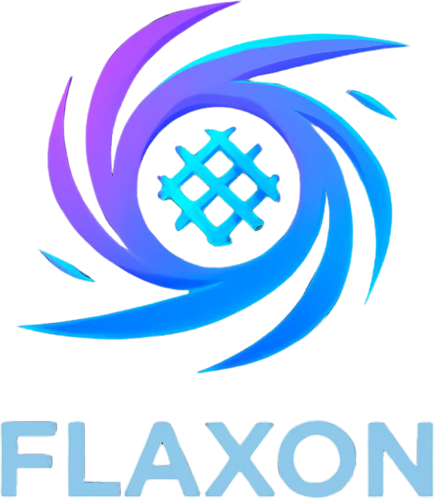

# Flaxon Website

<p align="center">
  
</p>

# Flaxon — Simple Python. Serious Applications.

<p align="center">
  <a href="https://flaxon.dev"></a>
  <a href="https://github.com/aldanedev-create/Flaxon-Backend-Framework"></a>
  <a href="https://github.com/aldanedev-create/Flaxon-Backend-Framework/blob/main/LICENSE"></a>
</p>

The official website and documentation for the Flaxon framework.

---

## 🚀 About Flaxon

Flaxon is a **technology-neutral, async-first Python backend framework** that combines Flask-like ease with production-grade power.

- **Async-first ASGI architecture** — Built for high-concurrency I/O workloads
- **Flask-style route decorators** — Familiar and intuitive
- **Optional modular structure** — Start simple, scale to large applications
- **Request validation** — Declarative schemas with automatic 422 responses
- **WebSocket support** — Real-time communication with room broadcasting
- **Jinax templates** — Optional Jinja2 integration (lazy-loaded)
- **Technology neutral** — Use any frontend, database, ORM, or client

---


---

## 🛠️ Development

### Prerequisites

- A web browser
- A code editor (VS Code recommended)
- Basic knowledge of HTML, CSS, and JavaScript

### Local Development

1. Clone the repository:
```bash
git clone https://github.com/aldanedev-create/flaxon-website.git
cd flaxon-website
Open index.html in your browser or use a local server:

bash
# Using Python
python -m http.server 8000

# Using VS Code Live Server extension
# Right-click index.html → Open with Live Server
Visit http://localhost:8000

Making Changes
Update HTML in the respective .html files

Update styles in assets/css/

Update JavaScript in assets/js/

Components in components/ are loaded via fetch()

🚀 Deployment
Deploy to Vercel (Recommended)
bash
npm install -g vercel
vercel
Deploy to Netlify
bash
# Drag and drop the project folder to Netlify Dashboard
# Or use the Netlify CLI
netlify deploy --prod
Deploy to GitHub Pages
Push to GitHub

Go to Settings → Pages

Set source to main branch

Custom domain: flaxon.dev

Deploy to Cloudflare Pages
bash
# Connect GitHub repo to Cloudflare Pages
# Build command: (none for static site)
# Output directory: /
🌐 Custom Domain
The site uses flaxon.dev. Configure your DNS:

Record Type	Name	Value
A	@	Your hosting IP
CNAME	www	flaxon.dev
📝 Documentation
The website includes:

56+ documentation pages covering all aspects of Flaxon

6 interactive examples demonstrating real-world usage

4 blog posts with news and updates

Complete API reference for all modules

Getting started guides for beginners

🎨 Design System
Colors
Color	Hex
Python Blue	#3776AB
Electric Blue	#00D4FF
Dark Slate	#0F172A
White	#FFFFFF
Light Gray	#F8FAFC
Typography
Primary: Inter (Google Fonts)

Fallback: -apple-system, BlinkMacSystemFont, 'Segoe UI', Roboto, sans-serif

Code: JetBrains Mono

Features
Dark mode toggle with persistent storage

Responsive design (mobile-first)

Component-based architecture

Search functionality

Syntax highlighting for code blocks

Interactive demos

🔧 Built With
Tool	Purpose
Tailwind CSS	Styling
Alpine.js	Interactivity
Font Awesome	Icons
Highlight.js	Code syntax highlighting
Chart.js	Interactive examples
Marked.js	Markdown rendering
📄 License
MIT License — see LICENSE for details.

🙏 Acknowledgments
Built with ❤️ for the Python community.

Flaxon — Simple Python. Serious Applications. 🚀
