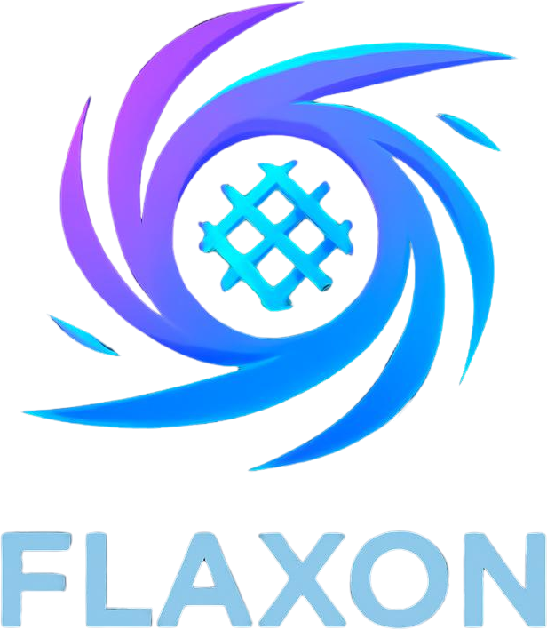

# Flaxon Documentation Website

This repository is the **Flaxon framework documentation website**. It is
separate from the Flaxon Labs organization website repository:

- Documentation: https://github.com/Flaxon-Labs/flaxon-website
- Organization website: https://github.com/Flaxon-Labs/flaxon-labs-website

The deployed documentation site is https://flaxon-website.vercel.app.

<p align="center">
  
</p>

# Flaxon — Simple Python. Serious Applications.

<p align="center">
  <a href="https://flaxon.dev"></a>
  <a href="https://github.com/aldanedev-create/Flaxon-Backend-Framework"></a>
  <a href="https://github.com/aldanedev-create/Flaxon-Backend-Framework/blob/main/LICENSE"></a>
</p>

The official website and documentation for the Flaxon framework.

---

## 🚀 About Flaxon

Flaxon is a **Python full-stack framework** with built-in Admin, CMS, authentication, database tools, WebSockets, and modules. Build interactive interfaces with **Teloce**, server-rendered applications with **Jinax**, or combine both.

* **Async-first ASGI architecture** — Built for high-concurrency I/O workloads
* **Flask-style route decorators** — Familiar and intuitive
* **Optional modular structure** — Start simple, scale to large applications
* **Request validation** — Declarative schemas with automatic 422 responses
* **WebSocket support** — Real-time communication with room broadcasting
* **Jinax templates** — Optional Jinja2 integration (lazy-loaded)
* **Technology neutral** — Use any frontend, database, ORM, or client

---

## 🛠️ Development

### Prerequisites

* A web browser
* A code editor (VS Code recommended)
* Basic knowledge of HTML, CSS, and JavaScript

### Local Development

1. Clone the repository:

```bash
   git clone https://github.com/Flaxon-Labs/flaxon-website.git
cd flaxon-website
```

2. Open `index.html` in your browser or use a local server:

```bash
# Using Python
python -m http.server 8000
```

Or use the VS Code Live Server extension:

```text
Right-click index.html → Open with Live Server
```

3. Visit:

```text
http://localhost:8000
```

### Making Changes

* Update HTML in the respective `.html` files
* Update styles in `assets/css/`
* Update JavaScript in `assets/js/`
* Components in `components/` are loaded via `fetch()`

---

## 🚀 Deployment

### Deploy to Vercel (Recommended)

```bash
npm install -g vercel
vercel
```

### Deploy to Netlify

```bash
# Drag and drop the project folder to Netlify Dashboard
# Or use the Netlify CLI
netlify deploy --prod
```

### Deploy to GitHub Pages

1. Push to GitHub.
2. Go to **Settings → Pages**.
3. Set the source to the `main` branch.
4. Set the custom domain to `flaxon.dev`.

### Deploy to Cloudflare Pages

Connect the GitHub repository to Cloudflare Pages.

```text
Build command: (none for static site)
Output directory: /
```

---

## 🌐 Custom Domain

The site uses `flaxon.dev`. Configure your DNS:

| Record Type | Name  | Value           |
| ----------- | ----- | --------------- |
| A           | `@`   | Your hosting IP |
| CNAME       | `www` | `flaxon.dev`    |

---

## 📝 Documentation

The website includes:

* 56+ documentation pages covering all aspects of Flaxon
* 6 interactive examples demonstrating real-world usage
* 4 blog posts with news and updates
* Complete API reference for all modules
* Getting started guides for beginners

---

## 🎨 Design System

### Colors

| Color         | Hex       |
| ------------- | --------- |
| Python Blue   | `#3776AB` |
| Electric Blue | `#00D4FF` |
| Dark Slate    | `#0F172A` |
| White         | `#FFFFFF` |
| Light Gray    | `#F8FAFC` |

### Typography

**Primary:** Inter (Google Fonts)

**Fallback:**

```text
-apple-system, BlinkMacSystemFont, 'Segoe UI', Roboto, sans-serif
```

**Code:** JetBrains Mono

### Features

* Dark mode toggle with persistent storage
* Responsive design (mobile-first)
* Component-based architecture
* Search functionality
* Syntax highlighting for code blocks
* Interactive demos

---

## 🔧 Built With

| Tool         | Purpose                  |
| ------------ | ------------------------ |
| Tailwind CSS | Styling                  |
| Alpine.js    | Interactivity            |
| Font Awesome | Icons                    |
| Highlight.js | Code syntax highlighting |
| Chart.js     | Interactive examples     |
| Marked.js    | Markdown rendering       |

---

## 📄 License

MIT License — see `LICENSE` for details.

---

## 🙏 Acknowledgments

Built with ❤️ for the Python community.

**Flaxon — Simple Python. Serious Applications. 🚀**

## Framework documentation

The site publishes 120 Markdown documents from the framework, plus eight
website-specific guides. The documentation home links to every page, including
the ten-lesson full-stack course, Jinax, Admin/CMS, APIs, and runnable projects.
The shared header, theme toggle, sidebar, search, and code-copy controls work
without loading a CSS framework or icon font on documentation pages.

The source snapshot and commit are recorded in `content/framework/manifest.json`.
Generated pages are committed, so hosting still needs only a static file server.

```bash
python -m pip install -r scripts/requirements-docs.txt
# Refresh the snapshot from an up-to-date framework checkout:
python scripts/sync_docs.py --source ../flaxon
# Or rebuild using the committed snapshot, without fetching the framework:
python scripts/sync_docs.py
python -m unittest discover -s tests -v
python -m http.server 8000
```

API directives are expanded from Python source signatures and docstrings during
sync, including lazy Admin exports, without importing optional framework drivers.
Relative Markdown links are rewritten to their site pages; code/project links
point to the pinned framework revision. Original Markdown remains downloadable.

For browser checks:

```bash
python -m pip install playwright==1.51.0
python -m playwright install chromium
python tests/browser_docs.py
```

These checks visit all documentation pages at desktop and mobile widths and
exercise theme persistence, navigation, search, copy buttons, blocked browser
storage, and project-prefix hosting. Search data and both navigation views are
built from the same manifest, so added framework docs stay discoverable.
